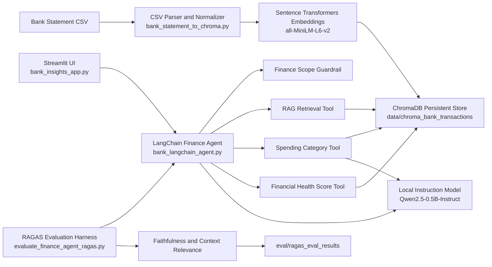

# Bank Statement Insights

A local-first personal finance assistant for bank statement analysis.

It ingests CSV statements into ChromaDB, answers finance questions with citation-backed retrieval, computes a lightweight financial health score, groups transactions by merchant category, and includes a RAGAS evaluation harness for a fixed 10-question benchmark.

## Demo GIF

Demo capture is not recorded yet from this environment.

When you have one, drop it at `docs/demo.gif` and uncomment or replace the line below:

```md

```

## Architecture



## Features

- Local embeddings with `sentence-transformers`
- ChromaDB-backed semantic retrieval over transactions
- LangChain agent with 3 tools:
  - `rag_retrieval_tool`
  - `spending_category_analyser`
  - `financial_health_score_tool`
- Finance-scope guardrail that refuses non-personal-finance questions
- Streamlit two-panel UI:
  - left: CSV upload plus health dashboard
  - right: chat with citations and supporting tables
- Fixed 10-question RAGAS evaluation harness

## Project Structure

```text
bank-statement-insights/
├── README.md
├── .gitignore
├── bank_insights_app.py
├── bank_langchain_agent.py
├── bank_statement_to_chroma.py
├── query_bank_transactions.py
├── evaluate_finance_agent_ragas.py
├── data/
│   └── chroma_bank_transactions/
├── docs/
└── eval/
    └── ragas_eval_results/
```

## Setup

Use the existing virtual environment you created earlier:

```powershell
D:\Documents\.venv\Scripts\Activate.ps1
```

Install the key dependencies if needed:

```powershell
pip install langchain chromadb sentence-transformers streamlit ragas datasets langchain-community langchain-huggingface
```

Or install from the repo files:

```powershell
pip install -r requirements.txt
```

For local RAGAS evaluation extras:

```powershell
pip install -r requirements-eval.txt
```

## Run

### 1. Start the UI

```powershell
D:\Documents\.venv\Scripts\streamlit.exe run D:\Documents\bank-statement-insights\bank_insights_app.py
```

### 2. Ingest a CSV from the CLI

```powershell
D:\Documents\.venv\Scripts\python.exe D:\Documents\bank-statement-insights\bank_statement_to_chroma.py "D:\path\to\statement.csv"
```

### 3. Query transactions directly

```powershell
D:\Documents\.venv\Scripts\python.exe D:\Documents\bank-statement-insights\query_bank_transactions.py "show all large UPI debits"
```

### 4. Use the agent from the CLI

```powershell
D:\Documents\.venv\Scripts\python.exe D:\Documents\bank-statement-insights\bank_langchain_agent.py "what is my financial health score?"
```

### 5. Run the RAGAS evaluation set

```powershell
D:\Documents\.venv\Scripts\python.exe D:\Documents\bank-statement-insights\evaluate_finance_agent_ragas.py
```

## Streamlit Cloud Deployment

This project is prepared for Streamlit Community Cloud.

Files added for deployment:

- `requirements.txt`
- `.streamlit/config.toml`

Deploy flow, based on the current Streamlit Community Cloud docs:

1. Push this folder to a GitHub repository.
2. Go to [share.streamlit.io](https://share.streamlit.io/).
3. Click `Create app`.
4. Choose your repository, branch, and entrypoint:
   `bank_insights_app.py`
5. In Advanced settings, select Python `3.12`.
6. Deploy.

Important notes:

- Streamlit Community Cloud installs dependencies from `requirements.txt` in the repo root or the app directory.
- Community Cloud runs `streamlit run` from the repo root and supports entrypoint files in subdirectories.
- This app downloads local Hugging Face models on first run, so cold starts may be slow.
- The local ChromaDB folder is in `data/chroma_bank_transactions`. If you want the deployed app to work immediately, commit a small seeded dataset or add an upload flow after deploy.

Official docs used:

- [File organization](https://docs.streamlit.io/deploy/streamlit-community-cloud/deploy-your-app/file-organization)
- [App dependencies](https://docs.streamlit.io/deploy/streamlit-community-cloud/deploy-your-app/app-dependencies)
- [Deploy your app](https://docs.streamlit.io/deploy/streamlit-community-cloud/deploy-your-app/deploy)

## Guardrail Behavior

The agent only answers questions that are clearly within personal finance scope.

Examples of allowed questions:

- "What was my largest UPI debit?"
- "What is my financial health score?"
- "Group my spending by merchant type"

Examples of refused questions:

- "What is the weather in Bengaluru today?"
- "Write me a poem about space"

## RAG Evaluation

The evaluation harness uses a fixed set of 10 questions and writes outputs to:

- `eval/ragas_eval_results/finance_agent_ragas_eval.csv`
- `eval/ragas_eval_results/finance_agent_ragas_summary.json`

Current caveat:

- The installed RAGAS version works, but local Hugging Face model compatibility is a bit rough and may still require follow-up tuning around async execution and metric behavior.

## What I Learned

- Real bank statement exports are much messier than “clean CSV” examples. Encoding, delimiter, and header handling matter a lot.
- Citation quality improves noticeably when the agent response and UI both rely on the same shared context payload.
- Guardrails are better when they are deterministic for narrow product scope instead of relying on a permissive LLM classifier.
- RAG evaluation libraries can have version-specific constraints that matter just as much as model quality.

## What I’d Improve Next

- Add native `.xls` and `.xlsx` ingestion instead of only CSV-oriented flows.
- Replace heuristic financial scoring with configurable rules and better category definitions.
- Add stronger merchant/category normalization for UPI-heavy statements.
- Improve the RAGAS harness so local-model evaluation is fully stable and reproducible.
- Record a proper demo GIF and add a few screenshots in `docs/`.
- Package the project as a small Python module with tests instead of keeping everything as top-level scripts.

## Notes

- The ChromaDB store is local and persistent under `data/chroma_bank_transactions`.
- The first run can be slow because local Hugging Face models are loaded into memory.
- The app and CLI are designed for personal finance analysis only, not general-purpose chat.
