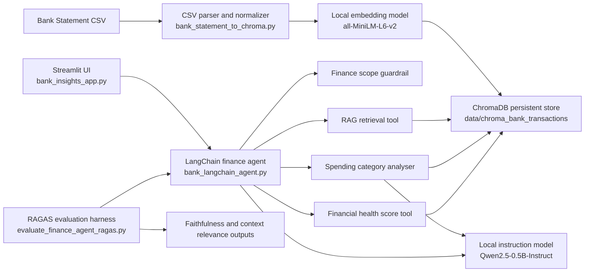

# Bank Statement Insights

A local-first personal finance copilot for bank statement analysis.

It ingests bank statement CSVs into ChromaDB, answers finance questions with citation-backed retrieval, computes a financial health score, groups spending by merchant category, and includes a small RAGAS evaluation harness.

Live app: [bankinsightsapppy-hewucidkqvbxdmstv84vyu.streamlit.app](https://bankinsightsapppy-hewucidkqvbxdmstv84vyu.streamlit.app/)

## Demo

<p align="center">
  
</p>

<p align="center">
  
</p>

## Architecture



## Features

- Local embeddings with `sentence-transformers`
- ChromaDB-backed semantic retrieval over transactions
- LangChain agent with three tools:
  - `rag_retrieval_tool`
  - `spending_category_analyser`
  - `financial_health_score_tool`
- Finance-scope guardrail for non-finance questions
- Streamlit two-panel UI with upload, health dashboard, and chat
- Citation-backed answers with supporting tables
- Fixed 10-question RAGAS benchmark harness

## Project Structure

```text
bank-statement-insights/
|-- README.md
|-- .gitignore
|-- bank_insights_app.py
|-- bank_langchain_agent.py
|-- bank_statement_to_chroma.py
|-- query_bank_transactions.py
|-- evaluate_finance_agent_ragas.py
|-- requirements.txt
|-- requirements-eval.txt
|-- .streamlit/
|   `-- config.toml
|-- sample_data/
|   |-- sample_bank_statement.csv
|   |-- sample_ragas_eval.csv
|   `-- sample_ragas_summary.json
|-- docs/
|   `-- .gitkeep
|-- data/
|   `-- chroma_bank_transactions/
`-- eval/
    `-- ragas_eval_results/
```

## Setup

Use the existing virtual environment:

```powershell
D:\Documents\.venv\Scripts\Activate.ps1
```

Install runtime dependencies:

```powershell
pip install -r requirements.txt
```

Install RAG evaluation extras if needed:

```powershell
pip install -r requirements-eval.txt
```

## Run Locally

Start the Streamlit app:

```powershell
D:\Documents\.venv\Scripts\streamlit.exe run D:\Documents\bank-statement-insights\bank_insights_app.py
```

Useful CLI commands:

```powershell
D:\Documents\.venv\Scripts\python.exe D:\Documents\bank-statement-insights\bank_statement_to_chroma.py "D:\path\to\statement.csv"
D:\Documents\.venv\Scripts\python.exe D:\Documents\bank-statement-insights\query_bank_transactions.py "show all large UPI debits"
D:\Documents\.venv\Scripts\python.exe D:\Documents\bank-statement-insights\bank_langchain_agent.py "what is my financial health score?"
D:\Documents\.venv\Scripts\python.exe D:\Documents\bank-statement-insights\evaluate_finance_agent_ragas.py
```

## Safe Demo Data

The repo includes fictional demo-safe files:

- `sample_data/sample_bank_statement.csv`
- `sample_data/sample_ragas_eval.csv`
- `sample_data/sample_ragas_summary.json`

The deployed app auto-seeds the sample CSV on first startup so it works even when the cloud filesystem starts empty.

## Deployment

This project is prepared for Streamlit Community Cloud.

Deployment notes:

1. Push the repo to GitHub.
2. Create a Streamlit app from `bank_insights_app.py`.
3. Redeploy when `requirements.txt` or model/runtime code changes.

Important notes:

- First load can be slow because local Hugging Face models need to initialize.
- The cloud app seeds ChromaDB from the sample CSV if the collection is missing.
- `requirements.txt` pins `protobuf==3.20.3` to stay compatible with ChromaDB on Streamlit Cloud.

## Guardrail Behavior

The assistant only answers questions within personal finance scope.

Allowed examples:

- "What was my largest UPI debit?"
- "Group my spending by merchant type"
- "What is my financial health score?"

Refused examples:

- "What is the weather today?"
- "Write me a poem about space"

## RAG Evaluation

The evaluation harness measures:

- faithfulness
- context relevance

Local outputs are written to:

- `eval/ragas_eval_results/finance_agent_ragas_eval.csv`
- `eval/ragas_eval_results/finance_agent_ragas_summary.json`

Demo-safe sample outputs are committed in:

- `sample_data/sample_ragas_eval.csv`
- `sample_data/sample_ragas_summary.json`

## What I Learned

- Bank exports are messy in real life, so encoding, delimiter, and header handling matter as much as retrieval quality.
- The best product feeling came from pairing semantic retrieval with deterministic finance-specific rules instead of relying entirely on an LLM.
- Deployment work mattered more than expected because ChromaDB and protobuf compatibility can break on hosted runtimes.
- Citation quality improved when the answer layer and UI both used the same structured context payload.

## What I Would Improve Next

- Add `.xls` and `.xlsx` ingestion, not just CSV-first parsing.
- Add stronger merchant normalization for UPI-heavy statements.
- Improve retrieval filtering so queries like "large debits above 5000" combine semantic and numeric constraints.
- Add tests around routing, parsing, and health score calculations.
- Replace the placeholder demo section with a real GIF and annotated screenshots.

## Notes

- `sample_data/sample_bank_statement.csv` is fictional and safe for demos.
- The app is designed for personal finance analysis, not general-purpose chat.
- The local ChromaDB store lives under `data/chroma_bank_transactions`.
